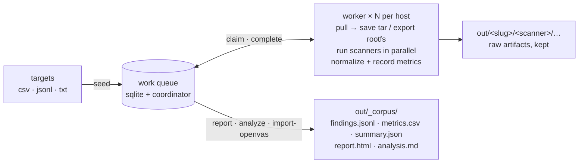

# scanners

Run a battery of container-security scanners over a list of images — on one
machine or many at once — and consolidate everything into one schema, keyed so
every finding traces back to the container (and its IP) that produced it.

> **Stage III of the ChimangoScan pipeline.** Discovery and prioritisation
> (Stage I crawler + Stage II layer graph + the exposure ranker) live in the
> [`DITector`](https://github.com/ChimangoScan/chimangoscan) repository and produce
> `exposure_ranked.jsonl` — one line per repository, sorted by supply-chain
> exposure. That file is the contract this repository consumes: feed it to
> `scanners seed` and the six default scanners run the multi-scanner sweep over
> the prioritised targets. The exposure ranker itself
> (`compute_exposure_ranking.py`) is **not** part of this repository — it is
> owned by `DITector`. End-to-end orchestration of both stages lives in the
> [`chimangoscan`](https://github.com/ChimangoScan/chimangoscan) repository.

Each scanner is a pinned Docker image. The pipeline pulls each target, runs the
scanners (static ones against the image, dynamic ones against the running
container), records timing and resource metrics, normalizes every finding, and
merges duplicates across scanners — so you can see *which* scanners agreed on a
CVE. Work is handed out by a queue; point any number of workers at the same
coordinator and add or remove machines whenever you like. A worker that dies has
its job reclaimed; kill the whole thing and restart and it picks up where it
stopped — down to the individual scanner.



**Contents** — [Install](#install) · [Quickstart](#quickstart--one-machine) ·
[Output](#output) · [Many machines](#many-machines) · [Commands](#commands) ·
[Layout](#layout) · [More](#more) — deeper docs:
[architecture](docs/architecture.md) ·
[scanners](docs/scanners.md).

## Install

Python ≥ 3.10 (managed by [uv](https://docs.astral.sh/uv/)) and a working
Docker daemon on every machine that runs workers. The only Python dependency is
PyYAML; the rest is the standard library.

```bash
git clone https://github.com/ChimangoScan/chimangoscan
cd scanners && uv sync
```

## Quickstart — one machine

```bash
make config                           # copy config/config.example.yaml → config.yaml (edit source.path)
uv run scanners seed                  # load targets into the queue (point source.path at DITector's exposure_ranked.jsonl)
uv run scanners run --workers 4       # pull each image, run the scanners
uv run scanners status                # progress
uv run scanners report -o report.html # the HTML corpus report
uv run scanners analyze               # out/_corpus/analysis.md — cross-scanner stats
```

(`make seed | run | status | report | analyze | …` are thin wrappers; `make help`
lists them.)

Six static scanners run by default — `syft`, `trivy`, `grype`, `osv-scanner`,
`dockle`, `trufflehog`. Five more (`clair`, `dependency-check`, `semgrep`,
`yara`, `clamav`) and the dynamic ones (`nuclei`, `nikto`, `zap`, `sqlmap`) are
off by default — enable per run with `scanners.only:` in the config or `--only`
on the CLI. Some need a one-time cache (`scanners prepare`) — see
[docs/scanners.md](docs/scanners.md).

Fold in scans done elsewhere (e.g. an existing OpenVAS run) — keyed by container
IP so they line up:

```bash
uv run scanners import-openvas --from /path/to/openvas_completo.csv && uv run scanners report
```

## Output

Under `output.dir` (default `out/`):

| path | what |
|---|---|
| `out/<target-slug>/<scanner>/…` | every raw artifact the scanner wrote, kept verbatim |
| `out/<target-slug>/report.json` | per-target consolidation: invocations, metrics, findings |
| `out/_corpus/findings.jsonl`    | one line per *merged* finding (`found_by` = which scanners saw it) |
| `out/_corpus/metrics.csv`       | one row per `(target, scanner)`: status, exit, wall, CPU%, RAM, bytes, findings |
| `out/_corpus/summary.json`      | aggregates: by severity/category, per-scanner, throughput, CVE agreement |
| `out/_corpus/report.html`       | the HTML report |
| `out/_corpus/analysis.md`       | the Markdown analysis: within-category overlap & agreement, exclusivity, cost, most-exposed containers |

Every normalized finding carries `target_image`, `target_name`, `target_ip`, and
`endpoint` (host:port, for dynamic findings) — a vulnerability is always tied to
the container that produced it.

## Many machines

The coordinator holds the queue; workers anywhere hit it over HTTP (reverse SSH
tunnels mean the coordinator port needn't be reachable from the worker hosts).

```bash
uv run scanners coordinator &       # serves the queue
uv run scanners seed
uv run scanners cluster prepare     # warm one-time caches on each remote host
uv run scanners cluster up          # rsync the repo + start workers everywhere
uv run scanners status
uv run scanners cluster down        # stop workers + tear down tunnels
uv run scanners collect             # rsync raw artifacts back (findings + metrics are already central)
```

Set `queue.backend: http` and your worker SSH aliases under `cluster.hosts` in
your **local** `config/config.yaml` (gitignored — hostnames and credentials stay
local).

## Commands

```
scanners seed [--limit N]                       load the source into the queue
scanners run  [--workers N] [--scan-parallelism K] [--only ...] [--skip ...]
              [--static-only|--dynamic-only] [--watch]    drain the queue here
scanners prepare [--only ...]                   warm one-time caches (CVE DBs, rule sets)
scanners coordinator [--bind host:port]         serve the queue over HTTP
scanners status [--json]                        queue progress
scanners reset [--failed] [--skipped] [--done] [--stale]   requeue jobs
scanners import-openvas [--from PATH]           fold an external OpenVAS run in
scanners report [-o PATH]                       rebuild aggregates + render HTML
scanners analyze [-o PATH] [--top N]            cross-scanner stats → analysis.md
scanners collect [--hosts ...]                  rsync raw artifacts from cluster hosts
scanners cluster {up|prepare|down|status} [--only ...]
```

CLI flags override config keys for that invocation (useful on remote workers
that have no config file): `--queue-url`, `--queue-token`, `--out-dir`,
`--cache-dir`, `--dockerhub-accounts`, `--workers`, `--scan-parallelism`, etc.
`config/config.example.yaml` documents every config key.

## Layout

```
scanners/
├── config/
│   ├── scanners.yaml          the scanner registry (image, invocation, what each reads)
│   └── config.example.yaml    the run config — every key documented
├── src/scanners/
│   ├── models.py              Target, Finding, ScanInvocation, TargetReport
│   ├── config.py              typed config loader
│   ├── sources/               catalog readers: csv | jsonl | txt → Targets
│   ├── jobqueue/              work queue: sqlite (one host) | http coordinator (many)
│   ├── dockerctl/             docker CLI wrapper, hardened container lifecycle, rootfs export, metrics, account pool
│   ├── adapters/              one module per scanner: invocation + parse() → Finding; the registry loader
│   ├── pipeline/              worker (per target, scanners in parallel) + runner (worker pool, heartbeats, reclaim)
│   ├── findings/              normalize / dedup, on-disk store, OpenVAS importer, analysis
│   ├── report/                corpus-level HTML report
│   └── cli.py                 the `scanners` entry point
├── docs/                      architecture · scanners
├── tests/                     queue semantics, dedup, adapter parsing, config/sources
├── Makefile                   make config | seed | run | status | report | analyze | cluster-up | clean
└── pyproject.toml             uv project; only runtime dep is PyYAML
```

## More

- [config/config.example.yaml](config/config.example.yaml) — every config key, commented.
- [docs/scanners.md](docs/scanners.md) — the scanner registry, what each scanner reads, adding one.
- [docs/architecture.md](docs/architecture.md) — design patterns, queue, worker lifecycle, normalization, resume.
