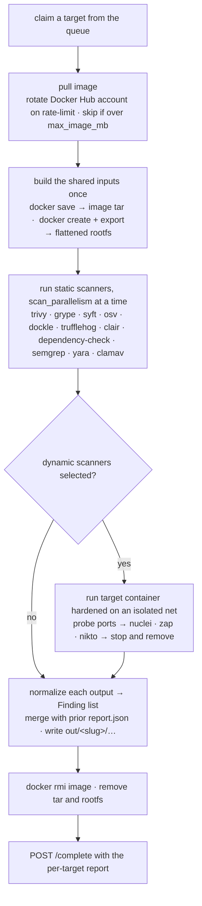

# Architecture

How a run actually executes: the queue, the per-target worker, how findings are
normalized and merged, and what "resume" means.

## Design

A few seams are kept explicit so behaviour is swappable without touching the
pipeline:

| seam | pattern | where |
|---|---|---|
| where work lives (one host vs. many) | **Strategy** + factory | `Queue` ABC → `SqliteQueue` / `HttpQueue`; `jobqueue.get_queue(cfg)` |
| where targets come from | **Strategy** + factory + **Template Method** | `Source` ABC → `CsvSource` / `JsonlSource` / `TxtSource`; `sources.get_source(cfg)`; `Source.targets()` is the skeleton (dedup → sort by weight → limit), `_iter()` is the hook |
| one scanner ↔ one tool's output | **Adapter** | a `ScannerSpec` (how to invoke) + a `parse(out_dir, target) → list[Finding]` module per scanner under `adapters/` — heterogeneous tool outputs become one `Finding` interface |
| the scanner set is data, not code | **Registry** | `config/scanners.yaml` → `adapters.registry.load_registry()` → `dict[str, ScannerSpec]` |
| handing out work | **Producer–Consumer** | the queue: `seed` produces, `run` workers consume |
| talking to Docker | **Facade** | `dockerctl.client` (CLI wrapper) and `dockerctl.ContainerManager` (pull / save / export rootfs / hardened run-probe-teardown / prune) |
| rotating Docker Hub credentials | **Object Pool** | `dockerctl.auth.AccountPool` — round-robin, re-login on a pull rate-limit |
| building the corpus view | **Builder** | `findings.CorpusStore.rebuild()` assembles `findings.jsonl` / `metrics.csv` / `summary.json` from a stream of per-target reports |

Adding a queue backend, a target source, or a scanner is therefore a localized
change: a new class implementing the ABC (plus a `get_*` case), or one
`scanners.yaml` entry plus one adapter module — see [scanners.md](scanners.md).

## The work queue

`jobqueue/base.py` defines a small `Queue` ABC — produce work (`seed`), consume
it (`claim` / `heartbeat` / `complete` / `fail` / `skip`), keep it tidy
(`reset_stale`, `reset`), introspect it (`stats`, `iter_reports`). Two
implementations:

- **`SqliteQueue`** (`jobqueue/sqlite_queue.py`) — a single WAL-mode SQLite file
  (`queue.sqlite_path`, default `work/queue.db`). Safe for many processes /
  threads on one host. This is the default backend and the only one that touches
  the database — the coordinator process uses it too.
- **`HttpQueue`** (`jobqueue/http_queue.py`) — the client side of the
  coordinator: every queue call is a JSON POST/GET to `queue.url`. Transient
  transport errors are retried with backoff (a 4xx is surfaced immediately, not
  retried). Workers on remote hosts use this; pick it with `queue.backend: http`
  or `--queue-url`.

The HTTP coordinator (`jobqueue/server.py`, `scanners coordinator`) is a small
threaded HTTP server wrapping a `SqliteQueue`: `POST /claim`, `/heartbeat`,
`/complete`, `/fail`, `/skip`, `/seed`, `/reset`, `/reset_stale`; `GET /stats`,
`/reports`, `/healthz`. An optional `queue.token` is checked as a `Bearer`
header (`""` disables auth).

### Job lifecycle

A job (one target) moves through `pending → running → done | failed | skipped`:

- **`pending`** — seeded, not yet claimed.
- **`running`** — claimed by a worker; carries `worker_id`, `attempts`,
  `started_at`, `heartbeat_at`.
- **`done`** — finished; its `TargetReport` is stored in the `reports` table.
- **`failed`** — a transient error, retries exhausted (`workers.job_attempts`,
  default 3). `fail()` re-queues the job (back to `pending`, attempt count kept)
  until `attempts >= max_attempts`, then it sticks.
- **`skipped`** — permanent: don't retry (image over `runtime.max_image_mb`,
  manifest gone, container exits on startup). Set by `skip()`.

**Atomic claim** — `SqliteQueue.claim()` does `BEGIN IMMEDIATE`, picks the
highest-`weight` pending row, flips it to `running` and bumps `attempts` in the
same transaction, then commits. A process-local lock serializes claims within a
worker process; the immediate transaction serializes them across processes. So
two workers never get the same job.

**Heartbeats** — while a job runs, a daemon thread (`pipeline/runner.py`,
`_Heartbeat`) calls `queue.heartbeat()` every `workers.heartbeat_seconds`
(default 30), which just bumps `heartbeat_at`.

**Stale reclaim** — `reset_stale(stale_minutes)` flips any `running` job whose
`heartbeat_at` (falling back to `started_at`) is older than
`workers.stale_minutes` (default 15) back to `pending`. `scanners run` calls it
once at startup, and `scanners reset --stale` calls it on demand. So a worker
that dies (or its machine) doesn't strand its job — another worker picks it up
once it goes stale.

**Idempotent seed** — `seed()` is `INSERT OR IGNORE` keyed on the image
reference; re-seeding the same source is a no-op for existing targets and
returns how many were genuinely new. Safe to run repeatedly.

**`reset`** — `scanners reset --failed` / `--skipped` / `--done` re-queues jobs
in those states (clearing the error). `--done` is for re-running a target after
you've enabled a new scanner — combined with `output.skip_done` it'll only
re-run the scanner that has no output yet (see below). `--stale` is the
reclaim above. Flags combine.

### Resume semantics

Two layers make a kill-and-restart cheap:

1. **`output.skip_done`** (default true). Before running a scanner, the worker
   checks `out/<slug>/<scanner>/` for the scanner's declared `outputs` /
   `capture_stdout` filenames; if any exists and is non-empty, the scanner is
   marked `ok-cached`, the existing output is re-parsed, and the scanner is **not
   re-run**. So a target that was half-scanned when you killed the run resumes at
   the scanner granularity — only the scanners that didn't finish run again. (To
   force a clean re-run: delete `out/` or set `skip_done: false`.) Note the
   *job* still re-enters the queue and the target is re-processed; it's the
   individual scanner work that's skipped.

2. **`worker._merge_prior_passes`**. After this pass finishes, the worker reads
   any existing `out/<slug>/report.json` and folds back the invocations and
   findings whose scanner *wasn't* in this pass's selection — plus the prior
   `container_ip` / `open_ports` / `http_endpoints` if this pass didn't get
   them. So `scanners run --only nuclei` over an already-scanned target *adds*
   nuclei's results to that target's `report.json` instead of replacing it.

## The worker

`pipeline/runner.py` spawns `workers.count` threads on the machine, each looping:
`claim` a job → start its heartbeat → `ScanWorker.run(target)` → `complete` (or
`skip` / `fail`) → next. `--watch` keeps idle workers waiting for new work
instead of exiting on an empty queue. `SIGINT`/`SIGTERM` stops cleanly.

`pipeline/worker.py` `ScanWorker.run(target)` does one target:

1. **Pull.** `ContainerManager.ensure_pulled` runs `docker pull` (with
   `runtime.pull_retries` / `pull_backoff`). On a registry rate-limit, if a
   Docker Hub account pool is configured the pull rotates to the next account
   immediately and retries; otherwise it backs off. If the pulled image exceeds
   `runtime.max_image_mb` (default 12000) the target is `skipped`
   (`TargetUnscannable`). A pull that fails for other reasons is also
   `skipped`.

2. **Build the shared inputs once.** Looking only at the scanners that aren't
   already cached: if any needs the tarball, `docker save` the image to
   `cache/tars/<slug>.tar`; if any needs the rootfs, `docker create` +
   `docker export | tar -x` into `cache/work/<slug>/rootfs/` (a failed export is
   logged; the rootfs scanners then record `error` for that target). These are
   produced up front so the concurrently-running scanners don't race to make
   them.

3. **Static phase.** All `mode: static` scanners run concurrently in a
   `ThreadPoolExecutor` sized `min(runtime.scan_parallelism, #scanners)`. Each
   gets `out/<slug>/<scanner>/` mounted at `/out` (read-write), the tarball at
   `/work/image.tar` and/or the rootfs at `/scan` (read-only) if it asked, and
   its cache dir at `cache_mount` if it has `needs_cache`. The container is run
   `--rm` while a side thread samples `docker stats` for the CPU/RAM peaks. A
   crash in one scanner never takes the target down — it's recorded as `error`.

4. **Dynamic phase** (if `scanners.dynamic` and any dynamic scanner is
   selected). If every dynamic scanner is already cached, just re-parse and
   skip the live container. Otherwise `ContainerManager.run` brings the target
   up: `docker run -d --rm` on the isolated bridge network
   (`runtime.network` / `runtime.subnet`, created on demand), hardened when
   `runtime.hardened` — `--cap-drop ALL`, `--security-opt no-new-privileges`,
   `--read-only` with tmpfs for `/run`,`/tmp`,`/var/run`, `--memory
   runtime.mem_limit`, `--pids-limit runtime.pids_limit`, `--cpu-quota
   runtime.cpu_quota` if set. If the container exits on startup with a
   read-only rootfs, it's retried writable; if it still exits, or gets no IP,
   the target's dynamic phase is `skipped`. Then: wait `runtime.startup_wait`
   seconds, TCP-probe `runtime.probe_ports` for up to `runtime.health_timeout`
   seconds, classify ports in `runtime.http_ports` (plus 443/8443 treated as
   `https://`) as HTTP endpoints, and run the dynamic scanners concurrently
   against it (each gets `{url}` / `{host}` / `{port}` of the first endpoint).
   Tear the container down afterward. Static findings get the container IP
   stamped onto them here so they line up with the dynamic ones.

5. **Normalize.** Every scanner's output directory is read back: its files
   become the invocation's `artifacts`, their total size its `output_bytes`,
   and the scanner's adapter `parse()` turns them into `Finding`s (counted into
   `findings` / `findings_by_severity`).

6. **Write.** `out/<slug>/<scanner>/...` already holds the raw artifacts;
   `out/<slug>/report.json` is written with the target's `invocations` and
   `findings` (after `_merge_prior_passes`). `complete()` stores that same JSON
   in the queue's `reports` table — so on the HTTP backend the findings and
   metrics are central without `collect`.

7. **Clean up.** Unless `output.keep_image_tarball`, the `cache/tars/<slug>.tar`
   and `cache/work/<slug>/` are deleted. If `runtime.remove_image_after`,
   `docker rmi` the target image. Every `runtime.prune_every` completed targets
   the worker runs `docker image prune -f`.

## Normalization & corpus aggregates

### `Finding`

`models.py`. Each normalized finding:

| field | what |
|---|---|
| `scanner` | which scanner produced this record |
| `category` | a `Category` (see below) |
| `severity` | a `Severity` — `critical` / `high` / `medium` / `low` / `info` / `unknown` |
| `id` | CVE / rule id / NVT OID — the cross-scanner join key |
| `title`, `description` | short text |
| `cvss` | numeric base score, or `None` |
| `package`, `version`, `fixed_version`, `ecosystem` | for package CVEs |
| `location` | file path / layer / URL path |
| `cves`, `references` | lists |
| `target_image`, `target_name`, `target_ip` | provenance — which container this came from |
| `endpoint` | `host:port` for dynamic findings |
| `raw` | the scanner's original record, untouched, carried all the way into the merged output |

`Category`: `pkg-vuln` (CVE in an installed package / dependency), `secret`
(embedded credential / key / token), `image-config` (hardening / CIS /
Dockerfile smell), `web-vuln` (a DAST scanner over HTTP), `network-vuln` (a
network scanner NVT, e.g. an OpenVAS NVT), `malware` (AV / YARA hit),
`sbom-component` (an inventory entry, not a finding), `other`.

### Dedup / merge — `findings/merge.py`

`dedup(findings)` collapses identical findings reported by several scanners into
one record. The group key is `(target_name, category, id-or-title.lower(),
package.lower(), endpoint-or-location.lower())` — i.e. the same vuln on the same
package on the same container, regardless of which scanner saw it. The merged
record:

- keeps the most-severe member's fields as the base,
- `severity` = the worst severity across members,
- `cvss` = the max across members,
- `cves` / `references` = the union (deduplicated),
- `target_ip` / `endpoint` / `fixed_version` = the first non-empty across
  members,
- `found_by` = the sorted set of scanners that saw it; `n_scanners` = its size,
- `raw` = `{scanner: that scanner's raw record}`.

Output is sorted worst-severity first. So a line in `findings.jsonl` tells you
*which* scanners agreed on a CVE.

### Corpus aggregates — `findings/store.py`

`CorpusStore.rebuild(reports, extra_findings)` (called by `scanners report` /
`scanners analyze`) reads every per-target report — from the queue's `reports`
table, or, on the SQLite backend with nothing there, from `out/*/report.json` on
disk — plus the imported-OpenVAS findings, dedups, and writes under
`out/_corpus/`:

- **`findings.jsonl`** — one line per merged finding.
- **`metrics.csv`** — one row per `(target, scanner)` invocation: status, exit
  code, wall seconds, peak CPU %, peak RAM MB, stdout/stderr/output bytes,
  findings count, error.
- **`targets.jsonl`** — one line per target (image, name, ip, container_ip,
  open_ports, finding count, timestamps, skip reason).
- **`summary.json`** — counts by severity / category, per-scanner stats (runs,
  ok, avg wall, peak mem, raw vs merged findings), package-CVE agreement
  histogram, targets-with-IP, and **`throughput`** (wall-clock span,
  targets/minute, targets/hour, avg & median seconds per target, total
  scanner-CPU seconds, and `parallel_efficiency` ≈ average concurrent scanner
  containers).

`scanners report` then renders `report.html` from this; `scanners analyze`
writes `analysis.md` (overlap matrix, exclusivity, cost, severity × category,
most-exposed containers).

## The OpenVAS importer

`findings/openvas_import.py` (`scanners import-openvas --from PATH`) folds an
existing OpenVAS run into the merged view. `PATH` is either a directory of
reports (it takes `*_completo.csv` files, falling back to any `*.csv`) or one
`*_completo.csv`. Each CSV row becomes a `Finding` with `scanner="openvas"`,
`category=network-vuln`, `id` = the NVT OID (or first CVE, or name), `endpoint`
= `ip:port`, severity from the `Severity` column or derived from CVSS. The
finding is **keyed by container IP** — the CLI builds an IP→target map from the
configured source first, so an imported finding gets the same `target_name` /
`target_image` as the rest of that container's findings and lines up in the
merge. The result is written to `out/_corpus/openvas_extra.jsonl` and folded in
every time `report` / `analyze` runs.
